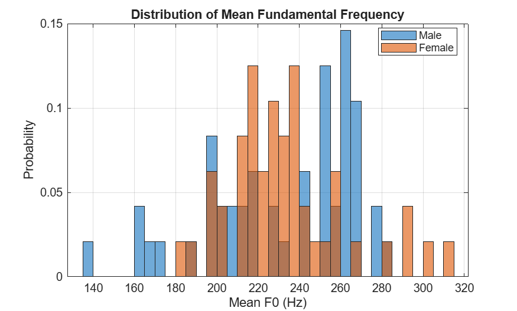
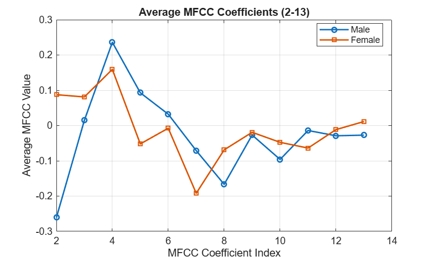
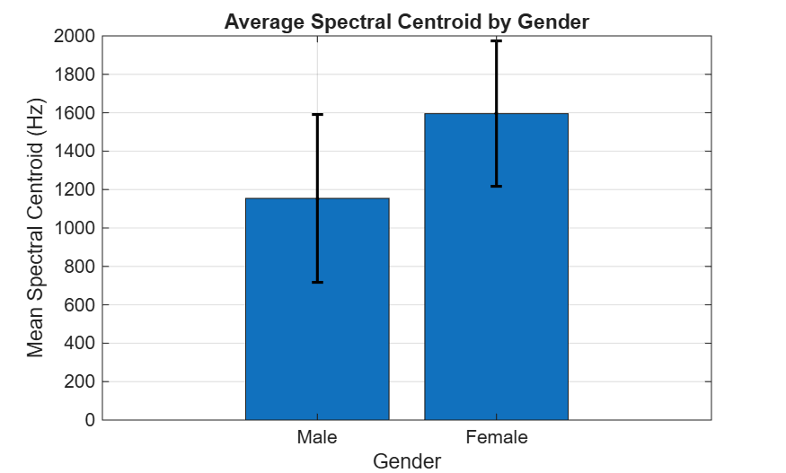
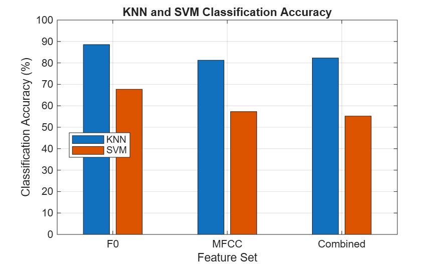
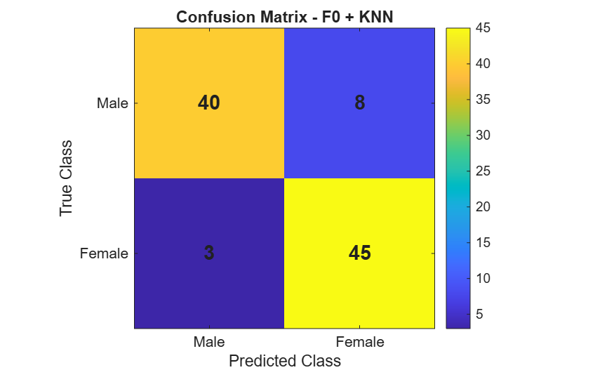

## Comparison of Acoustic Features for Male and Female Speaker Classification Using MATLAB

**Student:** Meiqi Song

## Project Overview

This project investigates whether different acoustic features can be used to classify male and female speech recordings using MATLAB.

Three feature sets are compared:

- Fundamental Frequency (F0)
- Mel-Frequency Cepstral Coefficients (MFCCs)
- Combined features using F0, MFCCs and Spectral Centroid

K-Nearest Neighbour (KNN) and a linear Support Vector Machine (SVM) are used for classification.

## Feedback 1 – Project Proposal

The first stage focused on defining the project topic, methodology and expected outcomes.

The original proposal is available here:

[ELEC5305 Project Proposal](ELEC5305%20Project%20Proposal.pdf)

## Feedback 2 – Current Progress

For the current stage, I used 96 neutral speech recordings from the RAVDESS dataset.

The dataset includes:

- 24 speakers
- 48 male recordings
- 48 female recordings

The audio recordings were preprocessed and converted to a common sampling frequency before feature extraction.

For each recording, F0, MFCC and Spectral Centroid features were extracted. Three feature sets were then tested using KNN and linear SVM classifiers.

Speaker-independent five-fold validation was used so that recordings from the same speaker were not included in both training and testing data.

## Preliminary Results

| Feature Set | KNN Accuracy | SVM Accuracy |
|---|---:|---:|
| F0 | 88.54% | 67.71% |
| MFCC | 81.25% | 57.29% |
| Combined | 82.29% | 55.21% |

The best current result was obtained using F0 features with KNN, with an accuracy of **88.54%**.

The confusion matrix for this model shows that:

- 40 of 48 male recordings were classified correctly
- 45 of 48 female recordings were classified correctly

These are preliminary results and may still change during the final stage.

## Results

### Mean F0 Distribution

### Average MFCC Comparison

### Spectral Centroid Comparison

### Classification Accuracy

### Best Model Confusion Matrix

## How to Run

1. Download or clone this repository.
2. Open the project folder in MATLAB.
3. Make sure the `Audio_Speech_Actors_01-24` folder is in the same project folder as the Live Script.
4. Open `Feedback2_Meiqi_Song.mlx`.
5. Run the Live Script from the beginning.

The script performs dataset loading, preprocessing, feature extraction, classification and result generation.

## Project Files

`Feedback2_Meiqi_Song.mlx`  
Main MATLAB Live Script.

`Audio_Speech_Actors_01-24`  
RAVDESS neutral speech recordings used in the current experiments.

`Results_Figures`  
Figures generated from the current analysis.

`ELEC5305 Project Proposal.pdf`  
Original project proposal.

## Dataset

This project uses the RAVDESS speech dataset.

Only the recordings used in the current experiments are included in this repository.

Original dataset:

https://zenodo.org/records/1188976

## Next Steps

The final stage will include precision, recall and F1-score, further result analysis, and the final project report.
